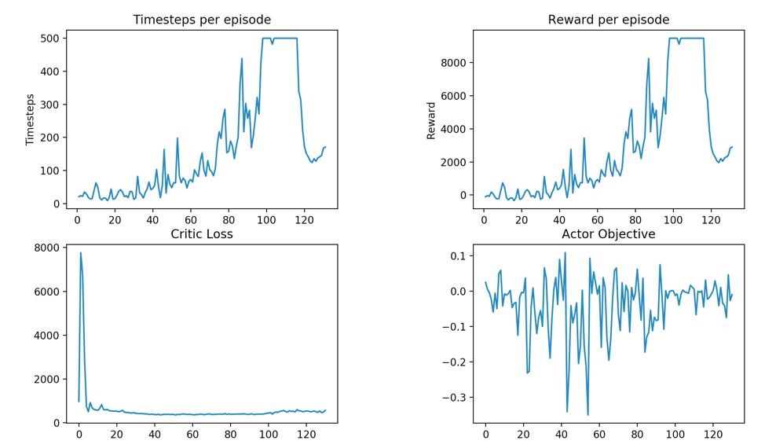

# Adaptive Systems

Project Description is available at [my university page](http://www.cs.toronto.edu/~shaktik/) under Proactive Troubleshooting [Aug2018-Present].

I will update this readme as I get more time, the individual files however have an extensive documentation.

```experiment_sin_stability.py```
 
 This file discusses an implementation of stabilizing a noisy sin function. The noise here is modelled as a gaussian with a choice of mean and variance.
A reward structure promoting the stability is defined. The Utility values are learnt using Generalized Policy Iteration method. There are _just 2 steps_ in the entire file,
1. Policy Evaluation U &rarr; U<sup>π</sup>

    Return(s) = &sum;&gamma;<sup>t</sup>R(S<sub>t</sub>)

    Q<sup>&pi;</sup>(s, a) = E {Return<sub>t</sub> | s<sub>t</sub>, a<sub>t</sub>}

    U<sup>&pi;</sup>(s) = E [ &sum;&gamma;<sup>t</sup>R(S<sub>t</sub>) ]

2. Policy Improvement π &rarr; greedy(U)

    &pi;(s) = argmax<sub>a</sub> Q(s,a)

```dqn.py```

This file gives a template for constructing a Deep Q Learning network. You can specify the no. of hidden units you want but for the moment it takes only one hidden layer.

```IRL/irl_finite_space.py```

This file implements the Finite Space IRL as put forth in Andrew Ng and Stuart Russel in [Algorithms for Inverse Reinforcement Learning](https://ai.stanford.edu/~ang/papers/icml00-irl.pdf). I used pulp based linear program solver but many people prefer using cvxopt package as well.

```dqn_sin_stability.py```

This is the most recent code I am stuck on (among many other codes :P ). This should ideally be a DQN implementation of stabilizing a sin function, or a general function. For any given continuous values of a noisy sin output, the agent should choose a noise correction scheme which smoothly approximates the sin function, or the function in consideration. Both the noise and the correction values can be continuous real values which makes this problem non trivial.

```acla_with_approxq.py```

Lately i realized that the function stabilization problem I was trying to handle couldnt be done without a continuos
action space consideration. I therefore tried my hands on some continuous action space RL algorithms, which as you'd
expect is just a slight variation of the DQN form. The file ```acla_with_approxq.py``` is an implementation of the Actor
Critic Learning Algorithm (ACLA). I tried out the following configurations, 
1. Actor and Critic with experience replays \[This training was by far the slowest I ever saw. There was a progress of 180 episodes over 8hours on an AMD Ryzen Threadripper 2990WX 128 GB\]
2. Combinations of fixing Q targets in Critic and Actor
3. Using dropouts in Actor
4. Combinations of stochastic/batch updates of critic/actor

Out of all these, updating Critic with experience replay without target scaling and actor in batch along with target scaling gave the best performance.
The environment was CartPole-v1. Timesteps of 500 were achieved within 100 episodes, a further learning rate decay for both actor and critic is expected to speed up this convergence.



PS. I am working on this file right now so it can appear a bit messed up, please excuse me for it :)


As always, if you'd like to know more about this research feel free to drop me an email.

```acla_with_mc_returns.py```

This file performs an actor critic learning algorithm with monte carlo estimates of the returns.
Several experiments were performed and were found consistent with stochastic behaviors of the gradients.
The stochastic parameter updates were best with an SGD with learning rate scheduling and nesterov accelerated gradient.
However, a full batch gradient descent beat the sgd by a large margin and converged within 500 episodes for cartpole v1.

